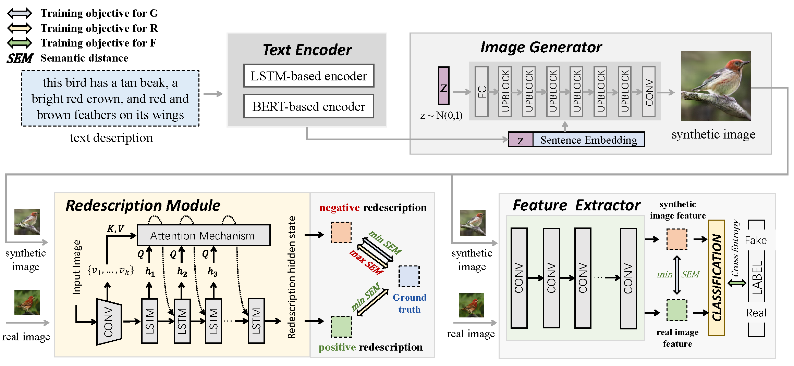

# SEMA: Semantic Distance Adversarial Learning for Text-to-Image Synthesis

Official Pytorch implementation for our paper Semantic Distance Adversarial Learning for Text-to-Image Synthesis

Details can be found in https://github.com/yuanrr/SEMA
